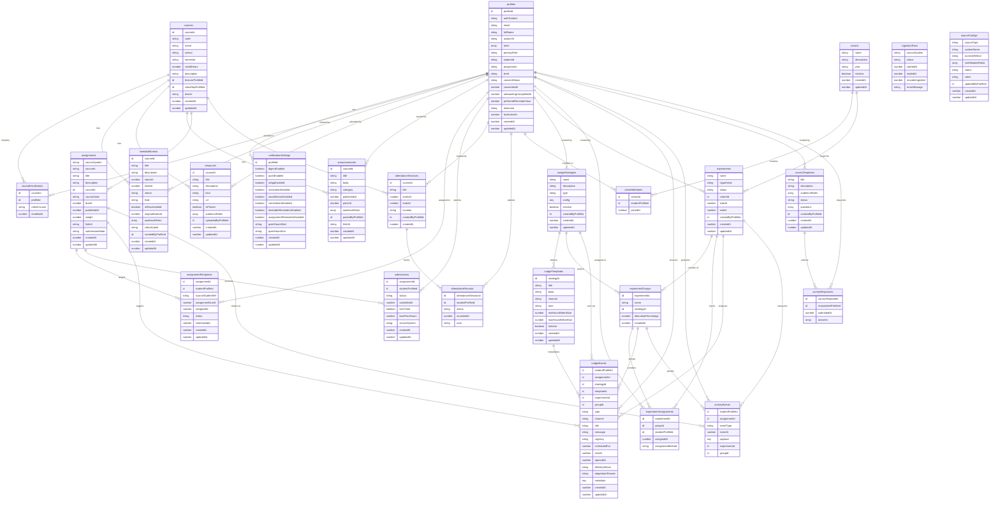

# Entity Relationship Diagram (ERD)

```mermaid
erDiagram
    profiles ||--o{ notificationSettings : "has"
    profiles ||--o{ courseEnrollments : "enrolled in"
    profiles ||--o{ timetableEvents : "created by"
    profiles ||--o{ resources : "uploaded by"
    profiles ||--o{ announcements : "posted by"
    profiles ||--o{ assignmentRecipients : "assigned to"
    profiles ||--o{ submissions : "submits"
    profiles ||--o{ attendanceSessions : "created by"
    profiles ||--o{ attendanceRecords : "attends"
    profiles ||--o{ cohortMembers : "member of"
    profiles ||--o{ nudgeStrategies : "created by"
    profiles ||--o{ experiments : "created by"
    profiles ||--o{ experimentAssignments : "assigned to"
    profiles ||--o{ nudgeEvents : "receives"
    profiles ||--o{ activityEvents : "performs"
    profiles ||--o{ surveyTemplates : "created by"
    profiles ||--o{ surveyResponses : "responds"

    courses ||--o{ courseEnrollments : "includes"
    courses ||--o{ timetableEvents : "has"
    courses ||--o{ resources : "has"
    courses ||--o{ announcements : "has"
    courses ||--o{ assignments : "has"
    courses ||--o{ attendanceSessions : "has"

    assignments ||--o{ assignmentRecipients : "targets"
    assignments ||--o{ submissions : "receives"
    assignments ||--o{ nudgeEvents : "triggers"
    assignments ||--o{ activityEvents : "relates to"

    cohorts ||--o{ cohortMembers : "contains"
    cohorts ||--o{ experiments : "target for"

    nudgeStrategies ||--o{ nudgeTemplates : "defines"
    nudgeStrategies ||--o{ experimentGroups : "used in"
    nudgeStrategies ||--o{ nudgeEvents : "sent via"

    nudgeTemplates ||--o{ nudgeEvents : "instantiates"

    experiments ||--o{ experimentGroups : "consists of"
    experiments ||--o{ experimentAssignments : "tracks"
    experiments ||--o{ nudgeEvents : "analyzes"
    experiments ||--o{ activityEvents : "measures"

    experimentGroups ||--o{ experimentAssignments : "contains"
    experimentGroups ||--o{ nudgeEvents : "groups"
    experimentGroups ||--o{ activityEvents : "groups"

    attendanceSessions ||--o{ attendanceRecords : "tracks"

    surveyTemplates ||--o{ surveyResponses : "collects"

    profiles {
        id profileId
        string authSubject
        string email
        string fullName
        string avatarUrl
        array roles
        string primaryRole
        string studentId
        string programme
        string level
        string consentStatus
        number consentedAt
        number onboardingCompletedAt
        number preferredReminderHour
        string timezone
        number lastActiveAt
        number createdAt
        number updatedAt
    }

    notificationSettings {
        id profileId
        boolean digestEnabled
        boolean pushEnabled
        boolean inAppEnabled
        boolean motivationEnabled
        boolean socialNormsEnabled
        boolean commitmentEnabled
        boolean timetableRemindersEnabled
        boolean assignmentRemindersEnabled
        string quietHoursStart
        string quietHoursEnd
        number createdAt
        number updatedAt
    }

    courses {
        id courseId
        string code
        string name
        string school
        string semester
        number creditHours
        string description
        id lecturerProfileId
        id classRepProfileId
        string lmsUrl
        number createdAt
        number updatedAt
    }

    courseEnrollments {
        id courseId
        id profileId
        string roleInCourse
        number enrolledAt
    }

    timetableEvents {
        id courseId
        string title
        string description
        number startsAt
        number endsAt
        string venue
        string kind
        boolean isRescheduled
        number originalStartsAt
        array audienceRoles
        string cohortLabel
        id createdByProfileId
        number createdAt
        number updatedAt
    }

    resources {
        id courseId
        string title
        string description
        string kind
        string url
        boolean isPinned
        array audienceRoles
        id uploadedByProfileId
        number createdAt
        number updatedAt
    }

    announcements {
        id courseId
        string title
        string body
        string category
        number publishedAt
        number pinUntil
        array audienceRoles
        id postedByProfileId
        string linkUrl
        number createdAt
        number updatedAt
    }

    assignments {
        string sourceSystem
        string sourceId
        string title
        string description
        id courseId
        string courseCode
        number dueAt
        number publishedAt
        number weight
        string linkUrl
        string submissionMode
        number createdAt
        number updatedAt
    }

    assignmentRecipients {
        id assignmentId
        id studentProfileId
        string sourceStudentRef
        number assignmentDueAt
        number assignedAt
        string status
        number lastViewedAt
        number createdAt
        number updatedAt
    }

    submissions {
        id assignmentId
        id studentProfileId
        string status
        number submittedAt
        boolean isOnTime
        number leadTimeHours
        string sourceSystem
        number createdAt
        number updatedAt
    }

    attendanceSessions {
        id courseId
        string title
        number startsAt
        number endsAt
        string location
        id createdByProfileId
        number createdAt
    }

    attendanceRecords {
        id attendanceSessionId
        id studentProfileId
        string status
        number recordedAt
        string note
    }

    cohorts {
        string name
        string description
        string year
        boolean isActive
        number createdAt
        number updatedAt
    }

    cohortMembers {
        id cohortId
        id studentProfileId
        number joinedAt
    }

    nudgeStrategies {
        string name
        string description
        string type
        any config
        boolean isActive
        id createdByProfileId
        number createdAt
        number updatedAt
    }

    nudgeTemplates {
        id strategyId
        string title
        string body
        string channel
        string tone
        number minHoursBeforeDue
        number maxHoursBeforeDue
        boolean isActive
        number createdAt
        number updatedAt
    }

    experiments {
        string name
        string hypothesis
        string status
        id cohortId
        number startAt
        number endAt
        id createdByProfileId
        number createdAt
        number updatedAt
    }

    experimentGroups {
        id experimentId
        string name
        id strategyId
        number allocationPercentage
        number createdAt
    }

    experimentAssignments {
        id experimentId
        id groupId
        id studentProfileId
        number assignedAt
        string assignmentMethod
    }

    nudgeEvents {
        id studentProfileId
        id assignmentId
        id strategyId
        id templateId
        id experimentId
        id groupId
        string type
        string channel
        string title
        string message
        string urgency
        number scheduledFor
        number sentAt
        number openedAt
        string deliveryStatus
        string adaptationReason
        any metadata
        number createdAt
        number updatedAt
    }

    activityEvents {
        id studentProfileId
        id assignmentId
        string eventType
        number eventAt
        any payload
        id experimentId
        id groupId
    }

    ingestionRuns {
        string sourceSystem
        string status
        number startedAt
        number endedAt
        number recordsIngested
        string errorMessage
    }

    sourceConfigs {
        string sourceType
        string systemName
        string accessMethod
        array minReliableFields
        string status
        string notes
        id updatedByProfileId
        number createdAt
        number updatedAt
    }

    surveyTemplates {
        string title
        string description
        array audienceRoles
        string status
        array questions
        id createdByProfileId
        number createdAt
        number updatedAt
    }

    surveyResponses {
        id surveyTemplateId
        id respondentProfileId
        number submittedAt
        array answers
    }
```
